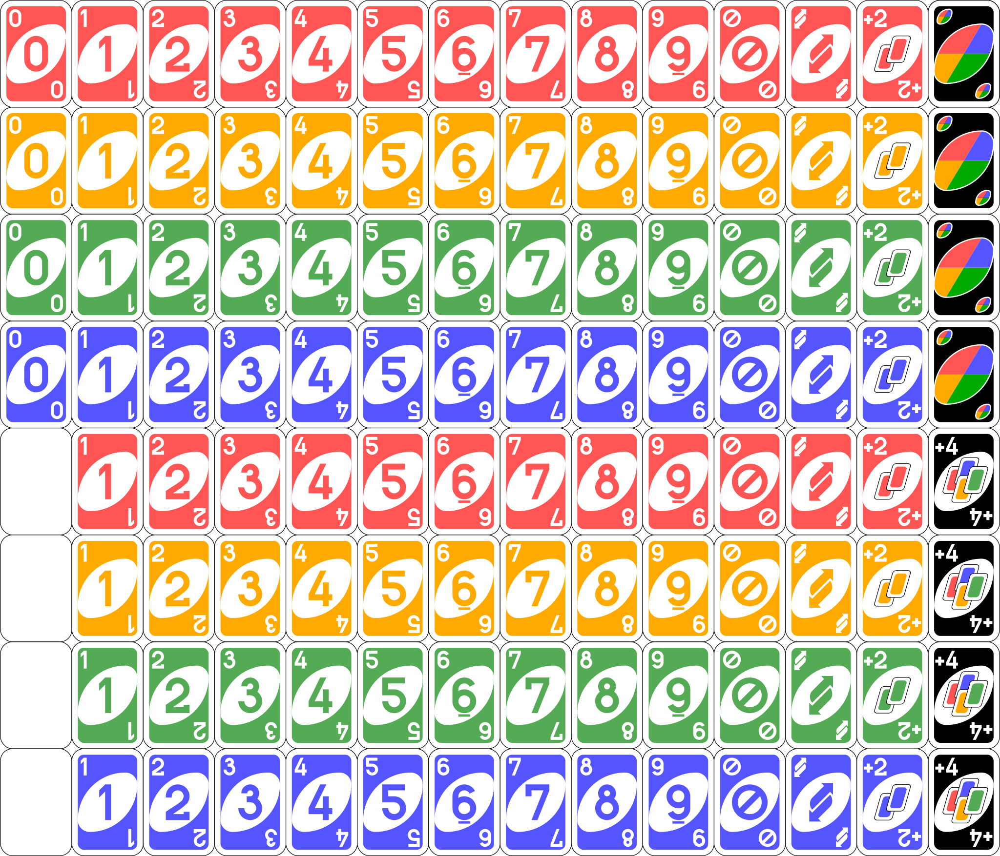

# UNO Game
 

Simple Java-based UNO game developed during the course software engineering 2

## Starting the JavaFX GUI
Run `mvn compile exec:java`

## Requirements
* Needs to follow the official game rules
* JavaFX-based GUI
* Client/Server gameplay over TCP
* Decoupling of game logic from view logic
    * Possibility to use different client in the future by the use of standardised interfaces
    * Separation of game logic, view and network in Java-packages
* Unit-testing of the game logic
* Console logging of the game logic
* Aims to follow clean code principles

## Project Priorities
1. Game logic with number and color cards
2. GUI
3. Multiplayer-functionality
4. Penalty cards
5. Scoring

## Game Rules
The following describes the official UNO game rules
### Deck
108 cards as follows:
* 19 blue cards (one zero, two each of 1 through 9)
* 19 green cards (one zero, two each of 1 through 9)
* 19 red cards (one zero, two each of 1 through 9)
* 19 yellow cards (one zero, two each of 1 through 9)
* 8 skip cards (2 each in blue, green, red and yellow)
* 8 reverse cards (2 each in blue, green, red and yellow)
* 8 draw 2 cards (2 each in blue, green, red and yellow)
* 4 Wild cards
* 4 Wild Draw 4 cards

### Setup
1. Every player starts with seven cards, and they are dealt face down. 
2. The rest of the cards are placed in a Draw Pile face down. 
3. Next to the pile a space should be designated for a Discard Pile. 
4. The top card should be placed face up in the Discard Pile.
5. Cards are played by laying them face-up on top of the discard pile. Play proceeds clockwise around the table.

### Game Play
* On a player's turn, they must do one of the following:
    * play one card matching the discard in color, number, or symbol
    * play a Wild card, or a playable Wild Draw Four card
    * draw the top card from the deck, then play it if possible
* A player who draws from the deck must either play or keep that card and may play no other card from their hand on that turn.
* A player may play a Wild card at any time, even if that player has other playable cards.
* A player may play a Wild Draw Four card only if that player has no cards matching the current color. The player may have cards of a different color matching the current number or symbol or a Wild card and still play the Wild Draw Four card. A player who plays a Wild Draw Four may be challenged by the next player in sequence to prove that their hand meets this condition.
* If the entire deck is used during play, the top discard is set aside and the rest of the pile is shuffled to create a new deck. Play then proceeds normally.
* A player who plays their next-to-last-card must call "Uno" as a warning to the other players.

### Action Cards
| Card           | Effect when played from hand                                                                                                                                                                          | Effect as first discard                                                               |
|----------------|-------------------------------------------------------------------------------------------------------------------------------------------------------------------------------------------------------|---------------------------------------------------------------------------------------|
| Skip           | Next player in sequence misses a turn                                                                                                                                                                 | Player to dealer's left misses a turn                                                 |
| Reverse        | Order of play switches directions (clockwise to counterclockwise, or vice versa)                                                                                                                       | Dealer plays first; play proceeds counterclockwise                                    |
| Draw Two       | Next player in sequence draws two cards and misses a turn                                                                                                                                             | Player to dealer's left draws two cards and misses a turn                             |
| Wild           | Player declares the next color to be matched (may be used on any turn even if the player has matching color)                                                                                          | Player to dealer's left declares the first color to be matched and plays a card in it |
| Wild Draw Four | Player declares the next color to be matched; next player in sequence draws four cards and misses a turn. May be legally played only if the player has no cards of the current color (see Penalties). | Return card to the deck, shuffle, flip top card to start discard pile                 |

### Scoring
* The aim of the game is to be the first player to score 500 points, achieved (usually over several rounds of play) by being the first to play all of one's own cards and scoring points for the cards still held by the other players.
* The first player to get rid of their last card ("going out") wins the hand and scores points for the cards held by the other players. Number cards count their face value, all action cards count 20, and Wild and Wild Draw Four cards count 50. If a Draw Two or Wild Draw Four card is played to go out, the next player in the sequence must draw the appropriate number of cards before the score is tallied.
* The first player to score 500 points wins the game.

## Docs
### Overview

### Activity Diagram
